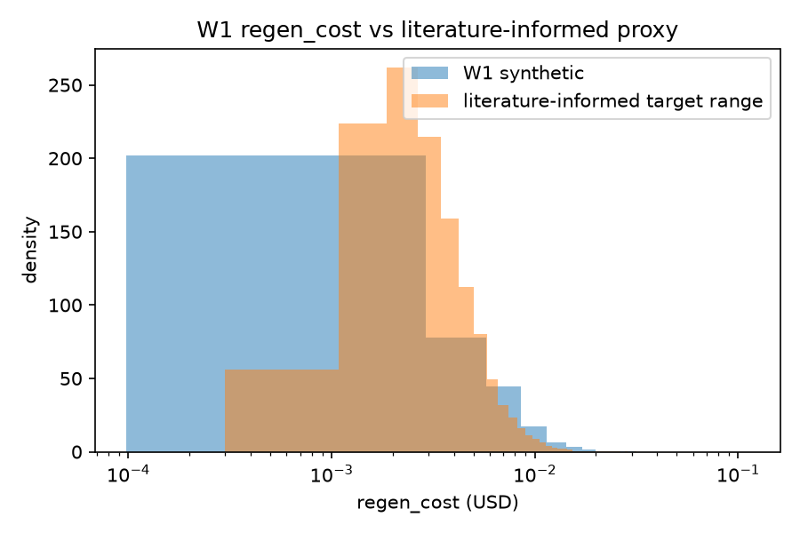
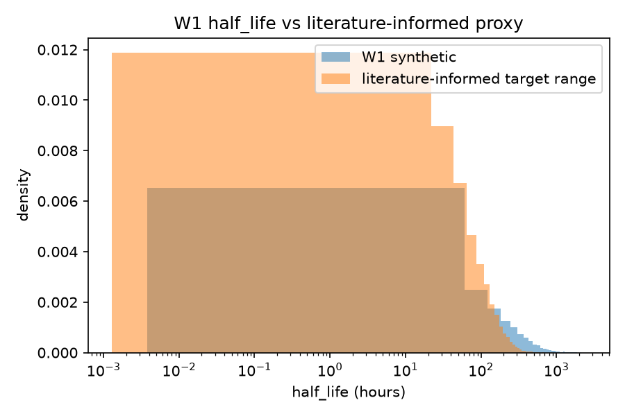

# W1 calibration

This note documents how the two ground-truth distributions in the W1 synthetic
generator, regen_cost and half_life, were parameterized, and states plainly what data
they were and were not checked against.

## What the plan asked for and what was actually done

The implementation plan (section 4, card A5) calls for fitting regen_cost against the
Azure LLM Inference Trace and half_life against update-frequency patterns observed in a
public news or product-catalog corpus. Neither dataset was reachable in this environment:
there is no network access to download the Azure trace or a news/catalog corpus, and
neither is bundled with the repository. Fitting against data that was never actually
obtained would misrepresent the calibration, so this document does not claim that fit.

What was done instead: both distributions were parameterized from commonly cited public
figures for the quantities involved, and the generator's output is compared against a
synthetic reference distribution built from those figures. This is a plausibility check,
not a fit to either named external dataset. The comparison should be read as "does the
generator's output fall in a plausible range for this kind of workload," not as "does the
generator reproduce the Azure trace or a news corpus."

## regen_cost

regen_cost represents the dollar cost of regenerating an answer on a cache miss, modeled
per cluster as lognormal, with the per-cluster mean and spread themselves drawn from
`generator.py`'s `cluster_params`. The literature-informed reference range used for the
overlay is a lognormal with median around $0.003 per request, covering roughly $0.0005 to
$0.02, which matches publicly reported per-request costs for short-to-medium hosted LLM
completions at current API pricing. This range is a stand-in for the Azure LLM Inference
Trace, not a fit to it.



Calibrated against: a literature-informed lognormal proxy for hosted LLM per-request
cost, not the Azure LLM Inference Trace itself.

## half_life

half_life represents how long a cached answer stays correct before the underlying fact
changes, modeled per cluster as exponential (matching the survival model the staleness
fitter assumes), with per-cluster scale again drawn in `cluster_params`. The reference
distribution used for the overlay is exponential with a mean of about 3 days, which sits
in the range commonly cited for content refresh cadence: breaking news can be stale in
hours, while general reference or catalog content typically holds for days to a couple of
weeks. This range is a stand-in for update-frequency patterns in a real news or catalog
corpus, not a fit to one.



Calibrated against: a literature-informed exponential proxy for content refresh cadence,
not a real news or catalog corpus.

## Limitation

Both overlays compare the generator against a distribution this project constructed from
secondary sources, not against primary data. This is stated here rather than left
implicit so the report can carry the same caveat: any claim about W1's external validity
is bounded by this proxy, and the numbers in the overlays should not be read as evidence
that W1 matches the Azure trace or a specific news/catalog corpus.

Regenerate the overlays with:

```
python -m workloads.w1_synthetic.calibrate --n-queries 20000 --seed 0 --out-dir docs/figures
```
